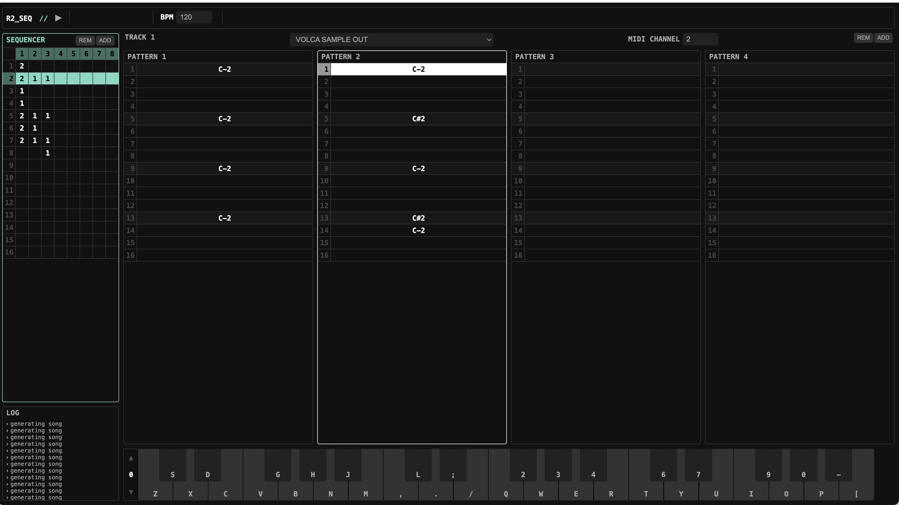
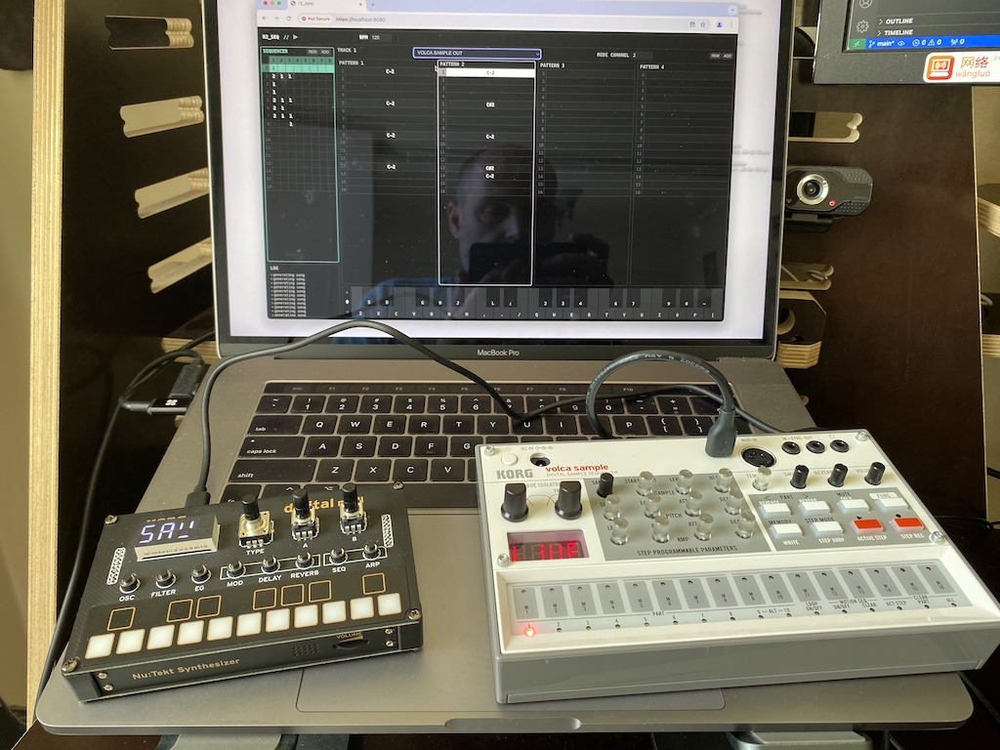

# R2_SEQ

R2_SEQ is a simple sequencer to control external midi devices. I runs in the browser and uses the WebMidi protocol to communicate with devices.

This was done in a weekend for an art project I am working on, and the code is hacked together by modifying the very cool browser based [pl_synth](https://github.com/phoboslab/pl_synth).

